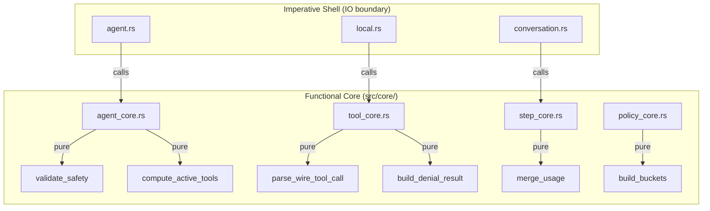
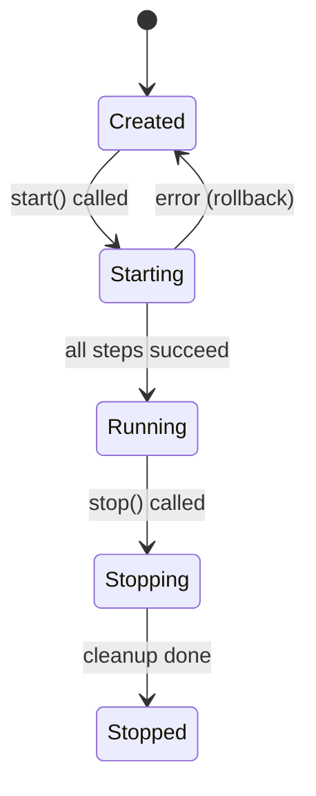

# Chương 5: Kiến Trúc Functional Programming (FP Architecture)

SDK Antigravity (Rust Edition) đã được refactor toàn bộ theo kiến trúc **Functional Programming (FP)** hiện đại nhất (SOTA), bao gồm 4 trụ cột chính:

| Trụ cột | Mô tả | Module |
|:--------|:------|:-------|
| **ROP** | Railway Oriented Programming | `src/core/pipeline.rs` |
| **FC-IS** | Functional Core – Imperative Shell | `src/core/` (5 modules) |
| **Actor Model** | Zero-lock concurrency | `src/actors/` |
| **Event Sourcing** | State machine + event log | `src/core/agent_core.rs` |

---

## 1. Railway Oriented Programming (ROP)

ROP là mô hình xử lý lỗi dạng pipeline — mỗi bước xử lý trả về `Ok(T)` (đường ray thành công) hoặc `Err(PipelineError)` (đường ray lỗi). Khi một bước thất bại, toàn bộ pipeline dừng lại ngay lập tức.

### 1.1 Cấu trúc Pipeline

```rust
// src/core/pipeline.rs

/// Lỗi pipeline — chứa thông tin stage, message, và error gốc.
pub struct PipelineError {
    pub stage: PipelineStage,  // Validation, Connection, ToolExecution, HookDispatch
    pub message: String,
    pub source: Option<Box<dyn std::error::Error + Send + Sync>>,
}

/// Kiểu pipeline — wrapper giúp chuỗi hóa các bước xử lý.
pub struct Pipeline<T>(pub Result<T, PipelineError>);
```

### 1.2 Trước và sau khi refactor

**Trước (monolith):**
```rust
// Agent::start() — 117 dòng, 8 cấp lồng nhau
pub async fn start(&mut self) -> Result<...> {
    if self.started { return Ok(()); }
    let mut hr = HookRunner::new();
    for hook in std::mem::take(&mut self.pending_hooks) { hr.register_hook(hook); }
    // ... 100+ dòng logic lồng nhau
    self.started = true;
    Ok(())
}
```

**Sau (pipeline steps):**
```rust
pub async fn start(&mut self) -> Result<...> {
    if self.phase == AgentPhase::Running { return Ok(()); }

    let mut hook_runner = self.build_hook_runner()?;       // Bước 1
    self.validate_and_apply_policies(&mut hook_runner)?;    // Bước 2
    let hr_arc = Arc::new(hook_runner);

    let mut mcp_bridge = self.connect_mcp_servers().await?; // Bước 3
    let tr_arc = self.build_tool_runner(mcp_bridge.as_mut())?; // Bước 4
    let connection = self.establish_connection(&hr_arc, &tr_arc).await?; // Bước 5
    self.create_conversation_and_triggers(&connection);     // Bước 6
    self.wire_tool_context(&tr_arc, &connection).await;     // Bước 7
    self.finalize_start(hr_arc, tr_arc, mcp_bridge);        // Bước 8

    self.phase = AgentPhase::Running;
    Ok(())
}
```

Mỗi bước là một phương thức riêng biệt, có tên rõ ràng, trả về `Result<T, E>`. Pipeline dừng ngay khi gặp lỗi đầu tiên (`?` operator).

### 1.3 handle_tool_call() — Pipeline 3 bước

```rust
async fn handle_tool_call(&self, wire_tc: ToolCall) {
    // Bước 1: Parse (pure function)
    let tc = match tool_core::parse_wire_tool_call(...) {
        Ok(tc) => tc,
        Err(e) => { warn!("..."); return; }
    };

    // Bước 2: Policy check (async)
    let (allowed, deny_msg, op_ctx) = self.check_tool_policy(&tc).await;
    if !allowed {
        let denial = tool_core::build_denial_result(&tc, ...);
        let _ = self.send_tool_results(vec![denial]).await;
        return;
    }

    // Bước 3: Execute + post-process (async)
    let result = self.execute_and_post_process(&tc, op_ctx).await;
    if let Some(result) = result {
        let _ = self.send_tool_results(vec![result]).await;
    }
}
```

---

## 2. Functional Core – Imperative Shell (FC-IS)

Đây là nguyên tắc cốt lõi: **tách biệt** logic thuần túy (pure functions) khỏi IO (side effects).



### 2.1 Các module thuần túy

#### `core/agent_core.rs`
| Hàm | Mô tả | Input | Output |
|:----|:------|:------|:-------|
| `compute_active_tools()` | Tính danh sách tool đang bật | `&CapabilitiesConfig` | `Vec<String>` |
| `validate_safety()` | Kiểm tra an toàn agent | tools, mcp, policies, hooks | `Result<(), PipelineError>` |
| `has_write_tools()` | Có tool ghi không? | `&[String]` | `bool` |

Ngoài ra còn chứa kiểu dữ liệu:
- `AgentPhase`: `Created → Starting → Running → Stopping → Stopped`
- `AgentEvent`: `HookRunnerCreated`, `ConnectionEstablished`, `Started`, `Stopped`

#### `core/tool_core.rs`
| Hàm | Mô tả |
|:----|:------|
| `parse_wire_tool_call()` | Chuyển đổi protobuf → `ToolCall` |
| `build_denial_result()` | Tạo kết quả từ chối |
| `resolve_tool_result()` | Xử lý recovery từ hook |
| `effective_deny_message()` | Xác định thông báo từ chối |

#### `core/policy_core.rs`
| Hàm | Mô tả |
|:----|:------|
| `bucket_index()` | Xác định nhóm policy |
| `matches_tool()` | So khớp tên tool với pattern |
| `build_buckets()` | Xây dựng bảng phân loại policy |

#### `core/step_core.rs`
| Hàm | Mô tả |
|:----|:------|
| `merge_usage()` | Gộp metadata token usage |
| `add_option()` | Cộng hai `Option<i32>` |

### 2.2 Lợi ích

- **Testability**: Test pure functions không cần mock, không cần async runtime
- **Deterministic**: Cùng input → luôn cùng output, không phụ thuộc trạng thái
- **Composable**: Kết hợp các hàm nhỏ thành pipeline lớn
- **Readable**: Mỗi hàm có tên mô tả rõ ràng chức năng

---

## 3. Actor Model

Thay thế mô hình "Mutex Soup" (8 trường `Arc<Mutex<...>>`) bằng mô hình Actor — mỗi actor chạy trong đúng một `tokio::spawn` task, sở hữu toàn bộ state, giao tiếp qua message passing.

### 3.1 Kiến trúc

```text
┌──────────────┐
│  WriterActor │ ← write_tx (bytes → WebSocket)
│  (WS Send)   │
└──────┬───────┘
       │ mpsc channel
┌──────┴───────┐    ┌──────────────┐
│  StateActor  │───→│  StepStream  │
│  (Central)   │    │  (→ Conv.)   │
└──────────────┘    └──────────────┘
```

### 3.2 StateActor — Trung tâm quản lý state

```rust
// Các loại message mà StateActor xử lý
pub enum StateMsg {
    // ── Commands (fire-and-forget) ──
    StepReceived(Step),        // Nhận step mới
    SetCascadeId(Option<String>),  // Cập nhật session ID
    AddSubagent(String),       // Thêm subagent
    AppendStderr(String),      // Ghi stderr (ring buffer)
    SetTurnContext(Option<TurnContext>),

    // ── Queries (với reply channel) ──
    GetCascadeId(oneshot::Sender<Option<String>>),
    HasTurnContext(oneshot::Sender<bool>),
    GetSnapshot(oneshot::Sender<StateSnapshot>),
    Shutdown,
}
```

### 3.3 Helper query()

```rust
// Gửi query và chờ response — giảm boilerplate
let cascade_id = query(&state_tx, StateMsg::GetCascadeId).await;
let snapshot = query(&state_tx, StateMsg::GetSnapshot).await;
```

### 3.4 Zero-Lock Guarantee

| Trước (Mutex Soup) | Sau (Actor Model) |
|:-------------------|:------------------|
| `Arc<Mutex<Option<TurnContext>>>` | `StateActor.turn_context: Option<TurnContext>` |
| `Arc<Mutex<HashSet<String>>>` | `StateActor.active_subagent_ids: HashSet<String>` |
| `Arc<Mutex<VecDeque<String>>>` | `StateActor.stderr_lines: VecDeque<String>` |
| Lock contention trên 8 Mutex | **0 Mutex**, sequential message processing |

---

## 4. Event Sourcing

Thay vì dùng `started: bool` đơn giản, Agent sử dụng state machine + event log.

### 4.1 AgentPhase — State Machine



### 4.2 AgentEvent — Event Log

```rust
pub enum AgentEvent {
    HookRunnerCreated { hook_count: usize },
    ConnectionEstablished { conversation_id: String },
    Started,
    Stopped,
}
```

### 4.3 Sử dụng

```rust
let agent = Agent::new(config);

// Kiểm tra phase
assert_eq!(*agent.phase(), AgentPhase::Created);

agent.start().await?;
assert_eq!(*agent.phase(), AgentPhase::Running);

// Xem event log
for event in agent.events() {
    println!("{:?}", event);
}
// Output:
// HookRunnerCreated { hook_count: 1 }
// ConnectionEstablished { conversation_id: "abc-123" }
// Started

agent.stop().await?;
assert_eq!(*agent.phase(), AgentPhase::Stopped);
```

---

## 5. Cấu Trúc Thư Mục Mới

```
src/
├── core/               # 🧮 Functional Core (pure functions, zero IO)
│   ├── mod.rs
│   ├── pipeline.rs     # ROP types: Pipeline<T>, PipelineError
│   ├── agent_core.rs   # AgentPhase, AgentEvent, validate_safety
│   ├── tool_core.rs    # parse_wire_tool_call, build_denial_result
│   ├── policy_core.rs  # bucket_index, matches_tool, build_buckets
│   └── step_core.rs    # merge_usage, add_option
├── actors/             # 🎭 Actor Model (zero-lock concurrency)
│   ├── mod.rs
│   ├── state_actor.rs  # StateActor — central state owner
│   └── writer_actor.rs # WriterActor — WebSocket write
├── agent.rs            # 🐚 Imperative Shell (orchestration)
├── connections/        # 🐚 Imperative Shell (network IO)
│   └── local.rs        # ROP pipeline handle_tool_call
├── conversation/       # 🐚 Imperative Shell (state coordination)
│   └── conversation.rs # Delegates to step_core
├── hooks/              # Hook system (policies, lifecycle)
├── tools/              # Tool runner and registration
└── triggers/           # Background trigger system
```

---

## 6. Nguyên Tắc Thiết Kế

| Nguyên tắc | Chi tiết |
|:-----------|:---------|
| `#![forbid(unsafe_code)]` | Tuyệt đối không có unsafe code |
| **Pure first** | Logic thuần túy trước, IO ở biên hệ thống |
| **Composition > Inheritance** | Kết hợp các hàm nhỏ thay vì kế thừa |
| **Type safety** | Enum + exhaustive matching, không dùng stringly-typed |
| **Immutable data** | Sử dụng `im::Vector` cho persistent data structures |
| **Zero-lock** | Actor model thay vì Mutex contention |
| **Event-driven** | State machine + event log thay vì boolean flags |

---

## Tham khảo thêm

- **Toàn bộ ví dụ**: [`examples/getting_started/fp_pipeline.rs`](../examples/getting_started/fp_pipeline.rs)
- **Architecture tổng quan**: [Chương 4](04_architecture.md)
- **Mã nguồn Functional Core**: [`src/core/`](../src/core/)
- **Mã nguồn Actor Model**: [`src/actors/`](../src/actors/)
